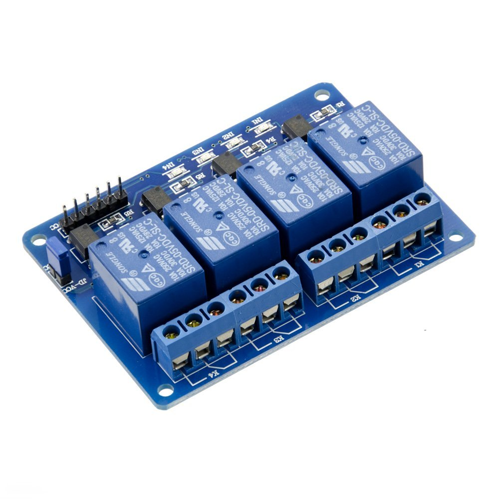
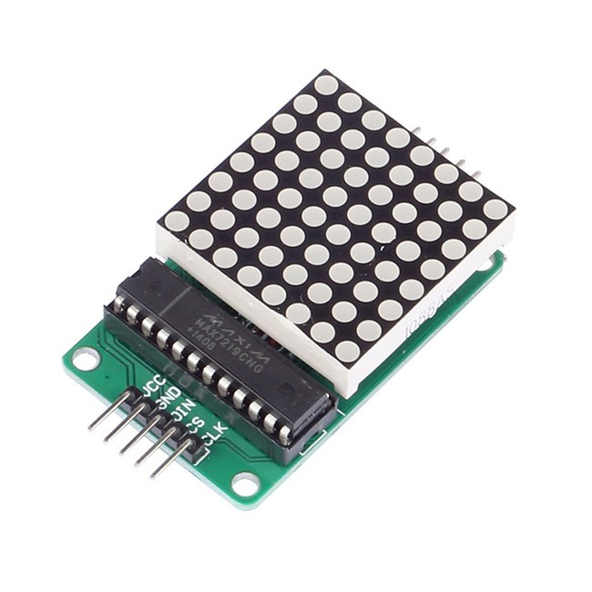
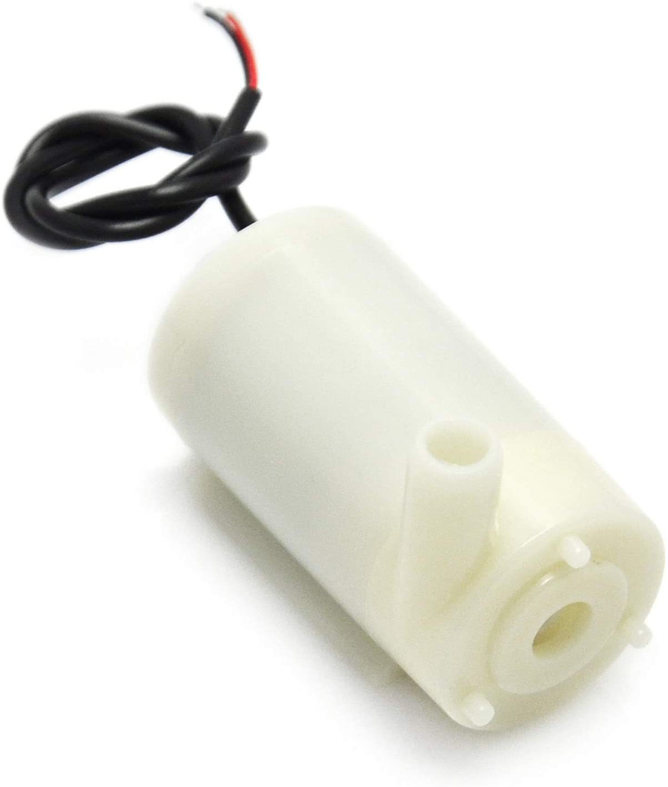
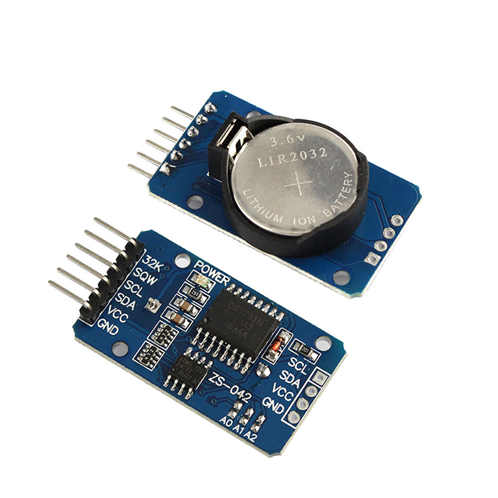
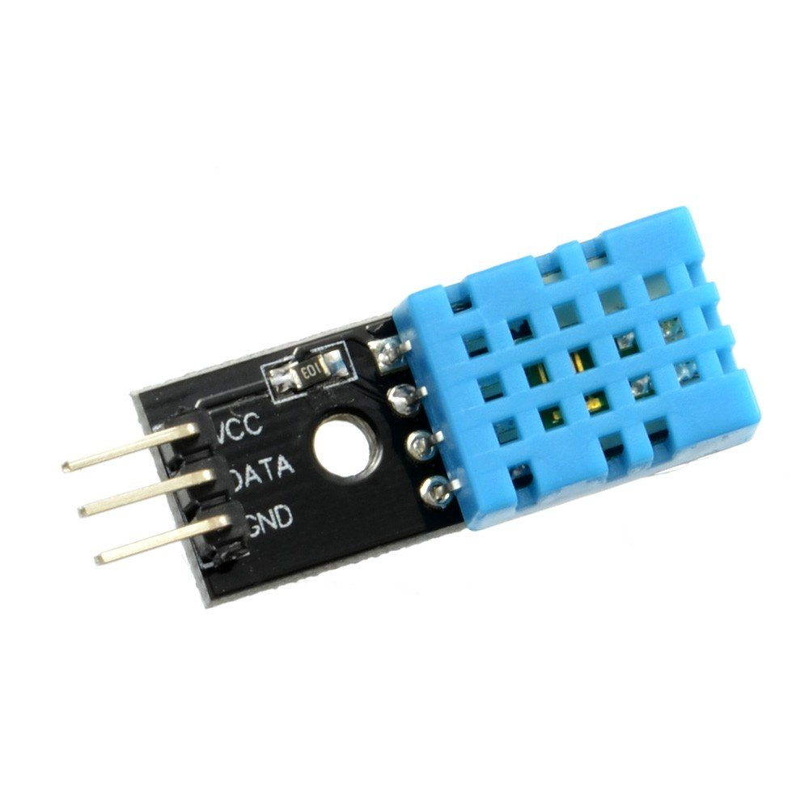
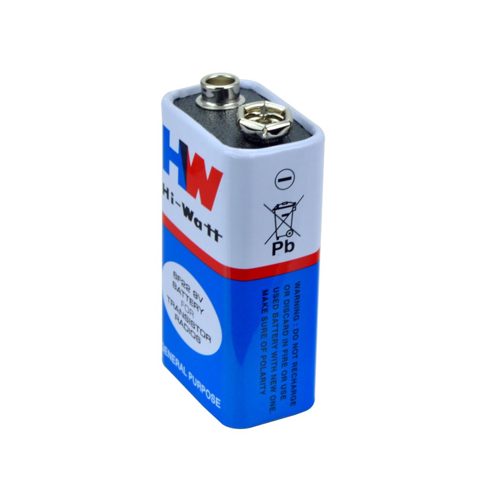
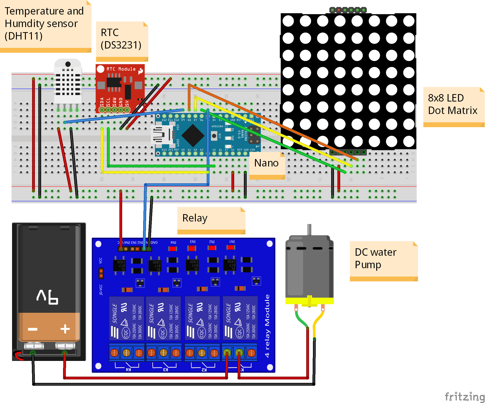

# hydr0
> An Arduino project for Monitoring your Hydroponic kit

(This is my first attempt at a open source hardware project lolidk)

## What is hydroponics?

Hydroponics is a subset of hydroculture, the method of growing plants without soil, using mineral nutrient solutions in a water solvent. The nutrients in hydroponics can come from an array of different sources; these can include but are not limited to byproduct from fish waste, duck manure, or commercial fertilisers.

Growing with hydroponics comes with many advantages, the biggest of which is a greatly increased rate of growth in your plants. With a proper setup, your plants will mature up to 25% faster and produce up to 30% more than the same plants grown in soil.

By monitoring the nutrient content, pH levels and providing Grow Lights and bubbling the nutrient water, the growth of the plants can be further be improved.

## Prototype 1
### Parts and Sensors used

| Part/Sensor | |
:-------------------------:|:-------------------------:
| Arduino Nano |  |
| 4 Channel Relay |  |
| LED Dot Matrix |  |
| 6V DC Pump |  |
| Real Time Clock (DS3231) |  |
| Temperature and Humidity Sensor (DHT11) |  |
| 9V Battery |  |

Other parts include Jumper cables, Breadboard, Mini USB Connector for Nano and battery clips.  

**Note**: This will work on all arduinos with slight change in pins used in the code

The fritzing diagram is in the `fritzing/` directory and the circuit is:

 

